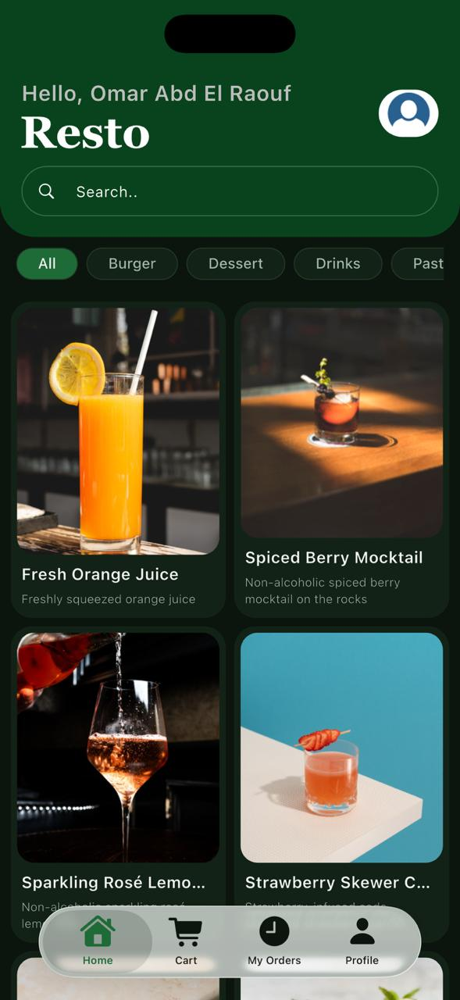
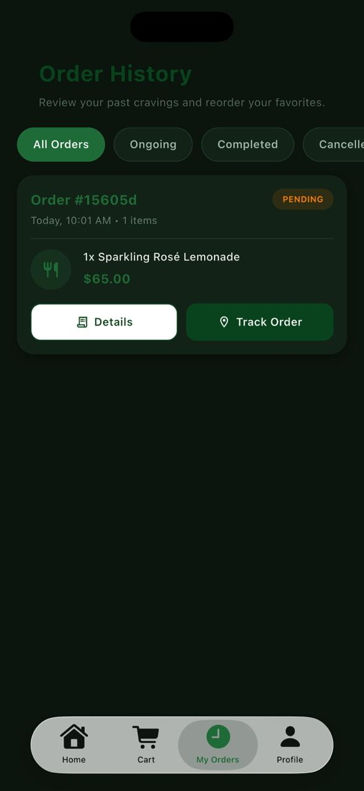
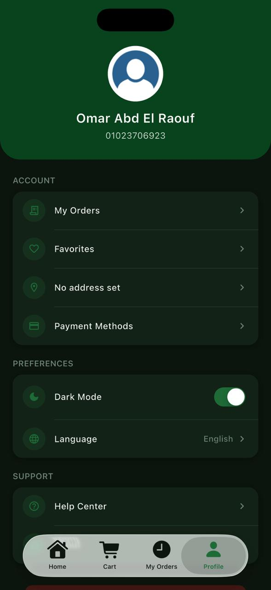
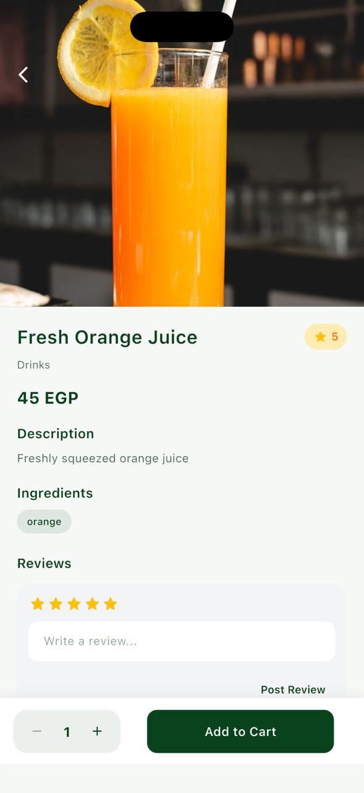
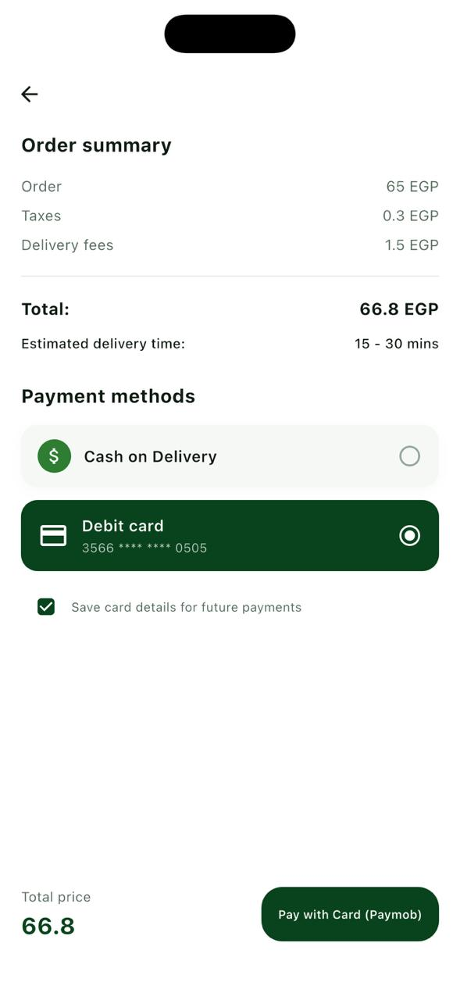
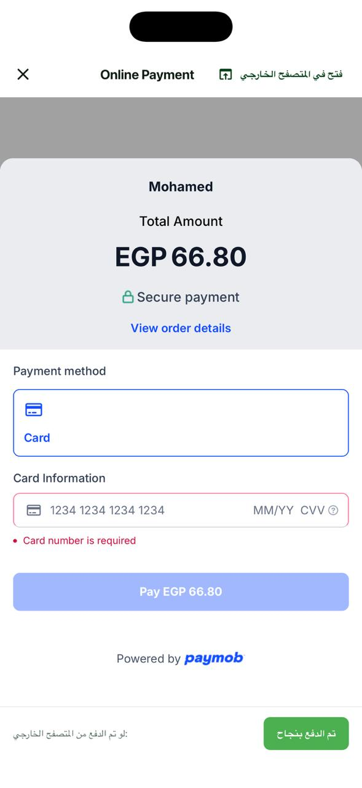

# 🍔 Resto — Food Delivery & Restaurant Ordering App

<p align="center">
  A modern food ordering mobile application built with Flutter, designed to provide a smooth and convenient restaurant ordering experience.
</p>

---

## 📱 About The Project

**Resto** is a Flutter-based food delivery and restaurant ordering application that allows users to browse meals, manage their cart, place orders, and choose between multiple payment methods.

The application focuses on providing a **smooth, responsive, and multilingual shopping experience** while following a scalable architecture and clean development practices.

---

## ✨ Features

* 🔐 **User Authentication**

  * JWT-based authentication
  * Secure user sessions

* 🍔 **Food & Restaurant Ordering**

  * Browse available meals
  * View meal details
  * Add and remove items from cart
  * Manage order quantities
  * Place food orders

* 🛒 **Shopping Cart**

  * Add items to cart
  * Update item quantities
  * Remove items
  * Calculate order totals

* 💳 **Multiple Payment Methods**

  * Paymob online payment integration
  * Cash on Delivery (COD)

* 🌍 **Multilingual Support**

  * Supports multiple languages
  * Localized application interface

* 📱 **Responsive UI**

  * Adaptive layouts for different screen sizes
  * Clean and user-friendly interface

* 🌐 **REST API Integration**

  * Backend communication using Dio
  * JSON-based API handling
  * Error handling and API response management

* ⚡ **State Management**

  * BLoC / Cubit architecture
  * Reactive and predictable state management

* 💉 **Dependency Injection**

  * GetIt for service and dependency management
  * Improved scalability and testability

---

## 🛠️ Tech Stack

| Technology       | Usage                          |
| ---------------- | ------------------------------ |
| **Flutter**      | Mobile application development |
| **Dart**         | Programming language           |
| **BLoC / Cubit** | State management               |
| **Dio**          | REST API communication         |
| **JWT**          | Authentication                 |
| **GetIt**        | Dependency Injection           |
| **Paymob**       | Online payment integration     |
| **REST API**     | Backend communication          |
| **Localization** | Multilingual support           |

---

## 🏗️ Architecture

The project follows a **scalable feature-oriented architecture** to keep the codebase maintainable and easy to extend.

The application separates responsibilities between presentation, business logic, data handling, and shared core functionality.

```text
lib/
├── core/
│   ├── constants/
│   ├── errors/
│   ├── network/
│   ├── services/
│   ├── utils/
│   └── ...
│
├── features/
│   ├── auth/
│   ├── home/
│   ├── cart/
│   ├── orders/
│   ├── payment/
│   └── ...
│
└── main.dart
```

---

## 💳 Payment Flow

Resto supports two different payment workflows:

### Online Payment

Users can complete their orders through **Paymob's online payment gateway**, providing a convenient digital payment experience.

```text
User
  ↓
Create Order
  ↓
Select Online Payment
  ↓
Paymob
  ↓
Payment Processing
  ↓
Order Confirmation
```

### Cash on Delivery

Users can also choose **Cash on Delivery**, allowing them to pay when the order is delivered.

```text
User
  ↓
Create Order
  ↓
Select Cash on Delivery
  ↓
Order Confirmation
  ↓
Delivery
  ↓
Cash Payment
```

---

## 📸 Screenshots

| 🏠 Home (Dark) | 📦 Orders (Dark) | 👤 Profile (Dark) |
| :---: | :---: | :---: |
|  |  |  |

<br>

| 🍔 Details (Light) | 🛒 Checkout (Light) | 💳 Payment Gateway |
| :---: | :---: | :---: |
|  |  |  |

---

## 🚀 Getting Started

### Prerequisites

Make sure you have the following installed:

* Flutter SDK
* Dart SDK
* Android Studio or VS Code
* Android Emulator or Physical Device

### Installation

1. Clone the repository:

```bash
git clone <YOUR_REPOSITORY_URL>
```

2. Navigate to the project:

```bash
cd resto
```

3. Install dependencies:

```bash
flutter pub get
```

4. Run the application:

```bash
flutter run
```

---

## ⚙️ Configuration

Before running the application, make sure to configure the required environment variables and API credentials.

For example:

```text
API_BASE_URL=your_api_url
PAYMOB_API_KEY=your_paymob_key
```

> ⚠️ Never commit private API keys, secrets, or credentials to the repository.

---

## 🔑 Authentication

The application uses **JWT (JSON Web Token)** authentication to securely authenticate users and authorize API requests.

The authentication flow includes:

```text
Register / Login
      ↓
Receive JWT Token
      ↓
Store Token
      ↓
Attach Token to API Requests
      ↓
Authenticated API Access
```

---

## 📂 Main Application Modules

* **Authentication** — Registration and login
* **Home** — Browse available food and restaurants
* **Product Details** — View meal information
* **Cart** — Manage selected items
* **Orders** — Create and track orders
* **Payments** — Online and cash payment workflows
* **Profile** — Manage user information
* **Localization** — Multilingual application support

---

## 🎯 Project Goals

The main goals of Resto were to:

* Build a complete food ordering experience
* Integrate real-world online payment functionality
* Implement secure authentication
* Practice scalable Flutter architecture
* Build responsive and reusable UI components
* Handle real-world REST APIs
* Provide a multilingual user experience

---

## 🧠 What I Learned

Through building Resto, I gained practical experience in:

* Building production-style Flutter applications
* Implementing **BLoC/Cubit** state management
* Working with REST APIs using **Dio**
* Implementing **JWT authentication**
* Integrating **Paymob payment services**
* Managing dependencies using **GetIt**
* Building responsive Flutter interfaces
* Implementing localization
* Designing maintainable application architecture

---

## 🔮 Future Improvements

Possible future improvements include:

* 🔔 Push notifications for order updates
* 📍 Real-time order tracking
* ⭐ Restaurant and meal reviews
* ❤️ Favorite meals and restaurants
* 🔎 Advanced search and filtering
* 📊 Order history and analytics
* 🎁 Discounts and promotional offers

---

## 👨‍💻 Author

**Mohamed Ehab**

Flutter Developer passionate about building modern, scalable, and user-friendly mobile applications.

### Connect With Me

* GitHub: **https://github.com/MoEhab74**
* LinkedIn: **https://www.linkedin.com/in/mohamed-ehab74/**

---

<p align="center">
  ⭐ If you found this project interesting, consider giving it a star!
</p>
